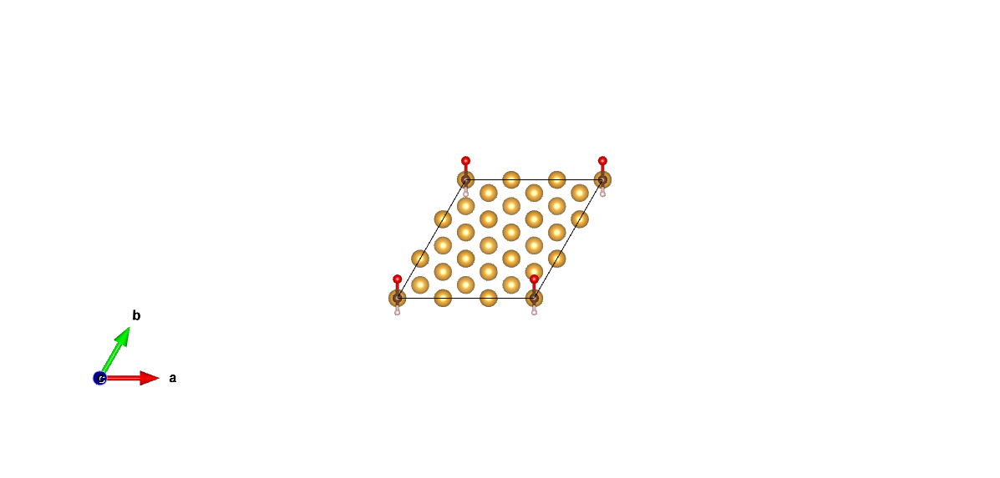
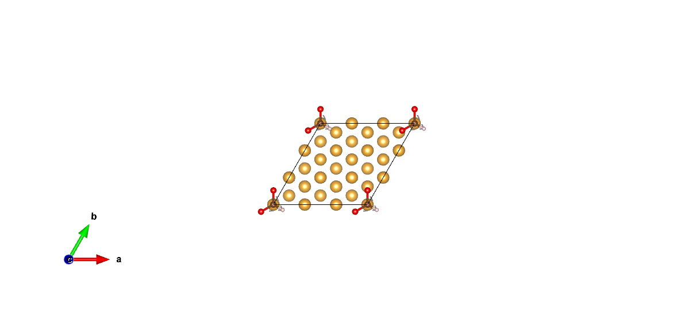
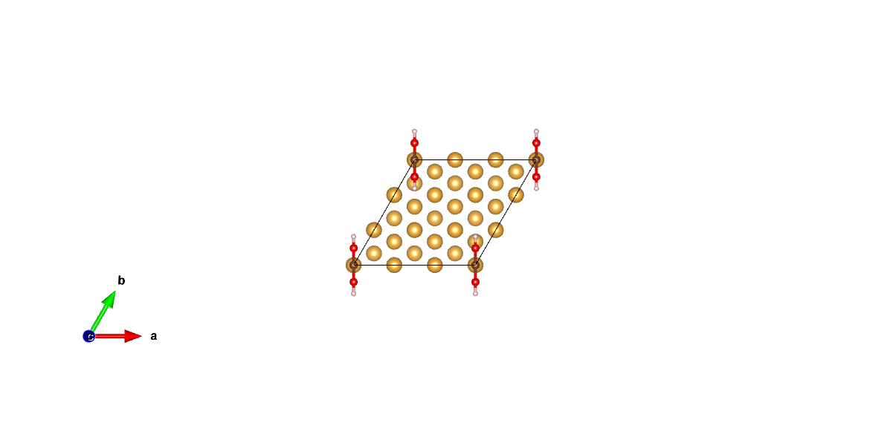

CO2 reduction
====================================

Introduction
------------

This example is mainly about CO2 reduction on the surface of Cu-doped Au, contributed by the developers of the project.

Inputs
------

The content of input file is as follow:

.. code-block::

    StrucInfo:
        file: POSCARfile
        struct:
            element: Au
            lattype: fcc
            latcont: 4.16
            facet: ['111'] 
            dope:
                Cu: ['0']

    Model:
        SML: True
        ads:
            - ['O[C][O]',1]
            - ['[O][CH][O]',1]
            - ['O[C]O',1]
            - ['[CH2]O',1]
            - ['[CH][O]',1]
            - ['[CH]O',1]

In the directory where the yaml file is located, use the command line to enter ``htmat ads`` to generate 9 vasp structure files.

Results
-------
24 vasp structure files named "Au_111_CO_x.vasp"(x is from 0 to 3).etc are generated. The visualization results generated by VESTA are as follow:

.. image:: 
    image/CO2_reduction/Au_111_[CH]O_0.png
    :width: 20cm

.. image:: 
    image/CO2_reduction/Au_111_[CH2]O_0.png
    :width: 20cm

