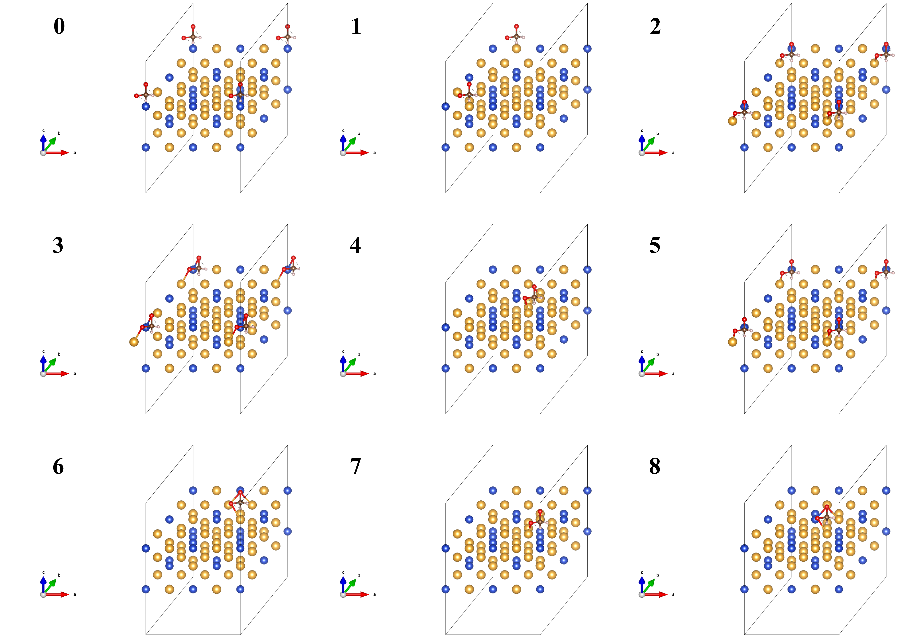

Formic acid adsorption (Cu-doped Au)
====================================

Introduction
------------

This example is mainly about adsorption of formic acid on the surface of Cu-doped Au, contributed by the developers of the project.

Inputs
------

The content of input file is as follow:

.. code-block::

    StrucInfo:
        file: POSCARfile
        struct:
            element: Au
            lattype: fcc
            latcont: 4.16
            facet: ['111'] 
            dope:
                Cu: ['b1']

    Model:
        SML: False
        ads:
            - ['HCOOH',1]

In the directory where the yaml file is located, use the command line to enter ``htmat ads`` to generate 9 vasp structure files.

Results
-------
9 vasp structure files named "Au_Cu_111_b1_HCOOH_x.vasp" (x is from 0 to 8) are generated. The visualization results generated by VESTA are as follow:

