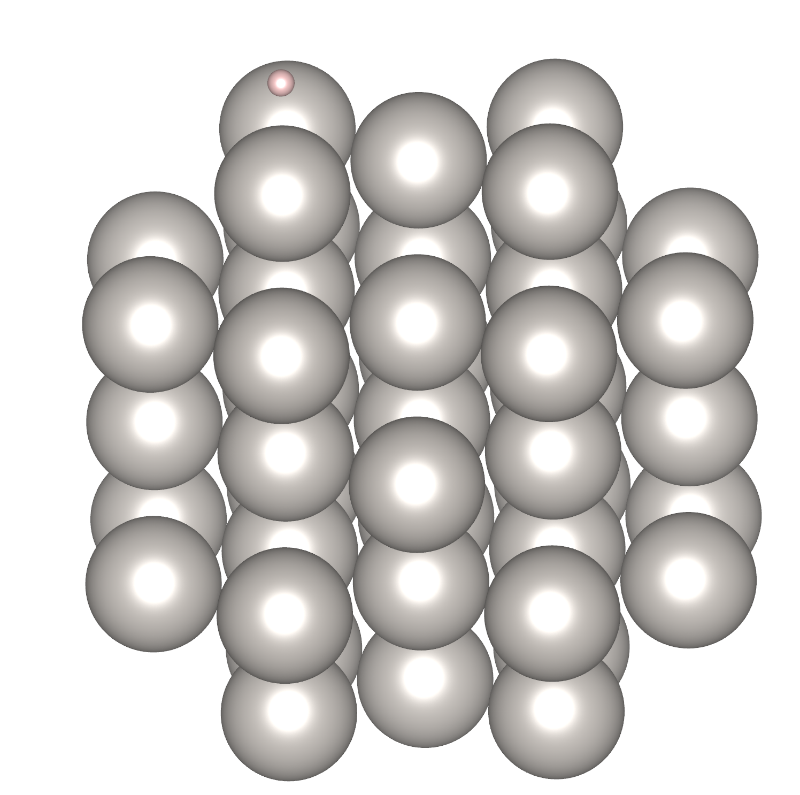

Nanoparticle (pristine Pt)
====================================

Introduction
------------

This example is mainly about adsorption of H atom on the surface of Pt Nanoparticle, contributed by the developers of the project.

Inputs
------

The content of input file is as follow:

.. code-block::

    StrucInfo:
        file: Pt43_particle

    Model:
        SML: False
        ads:
            - ['H',1]

*Pt43_particle* is nanoparticle configuration with *vasp* file formate pre construct by ASE module, 
In the directory where the yaml file is located, 
use the command line to enter ``htmat ads`` to generate 7 vasp structure files.

Results
-------
7 vasp structure files named "Pt43_particle_H_x.vasp" (x is from 0 to 6) are generated. 
The visualization results generated by VESTA are as follow:

